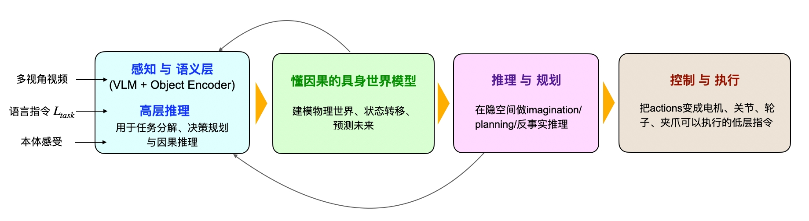
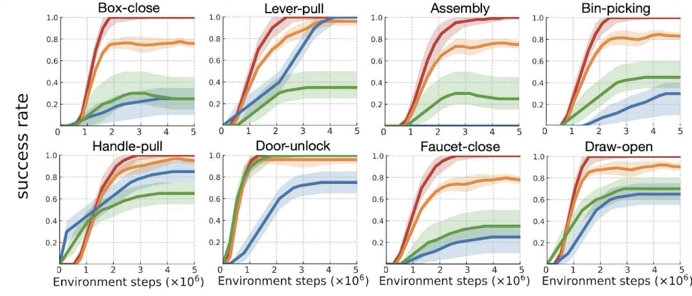
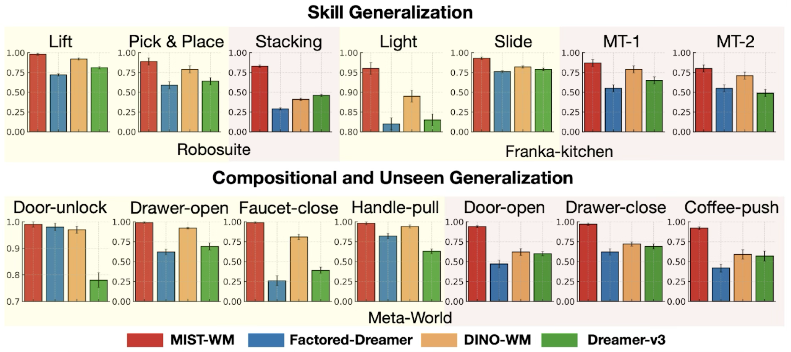
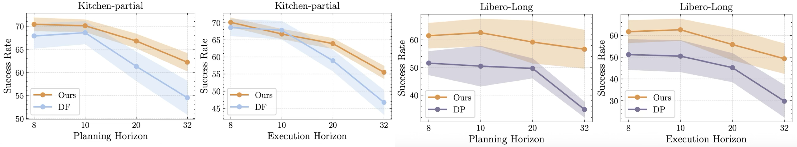
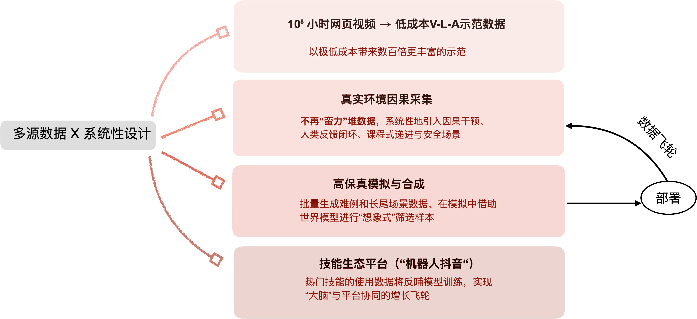
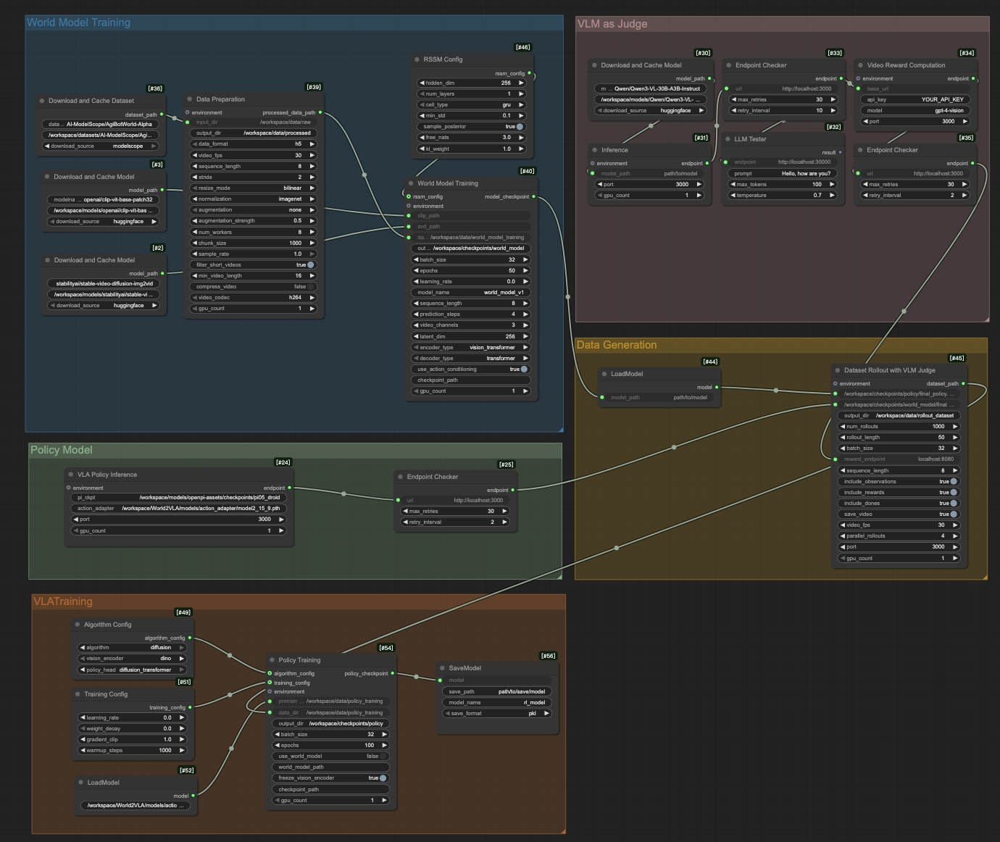

## Method Overview

端到端视觉–语言–动作模型（Vision–Language–Action, VLA）在多个场景中展现出令人印象深刻的效果，但如果作为机器人的唯一控制器，仍存在明显局限。作为纯粹的“反应式”控制器，VLA 缺乏对动力学和因果结构的显式建模，导致在长时序任务中存在以下问题：
- 轨迹鲁棒性差：微小感知误差会被不断放大，造成执行偏移甚至失败
- 难以诊断和纠正：缺乏可解释的决策过程
- 分布偏移时不安全：泛化能力有限
- 无法提前规划和验证：无法"想象"未来结果、比较动作方案或过滤高风险计划

为克服这些限制，我们提出了一个"三位一体"的架构：VLA + 世界模型 + 因果推理。其核心设计为：

**感知层（VLM）**：通过物体为中心的表征和语言引导的任务向量，提供语义理解和任务条件

**规划层（世界模型 + 因果推理）**：在紧凑的隐变量状态空间中进行长时序规划、想象推理和反事实分析

**执行层**：在真实执行前，智能体在隐空间中展开多条候选动作序列，评估预测结果（包括奖励和安全信号），选择最优且风险最低的方案下发给机器人。

这种将"感知理解"（VLA）与"规划决策"（世界模型 + 因果推理）结合的方法，显著提升了任务成功率、样本效率，并大幅降低了不安全行为。实验表明，我们的方案超越纯端到端 VLA。
对具身世界的因果过程进行显式建模，是构建可复用的通用机器人大脑的关键一步。

## 懂因果的具身世界模型

### 因果智能的有效性

在多种机器人操控任务、移动控制基准和长时序规划任务上，通过引入因果智能，相比传统世界模型，我们的方法取得以下成果：

- **任务成功率提升 25-50%**
- **训练样本减少 5-10 倍**
- **跨任务、跨环境、跨奖励函数时保持稳定泛化**
  
  
  

### 实验验证

#### 想象验证

给定视觉–语言指令，系统流程为：
1. VLA 生成多个候选动作序列
2. 世界模型在想象空间中模拟各序列的执行结果
3. 使用VLM评估每个序列的效果
4. 选择最优方案下发给真实机器人

由于 VLA 基于模仿学习，对环境变化高度敏感，微小偏差易累积放大。通过"想象验证"机制，我们先在虚拟空间验证动作序列的有效性，显著提高了执行鲁棒性。

**示例1**：对于"Pick up the marker and put it in the mug"任务，世界模型生成 9 个不同的动作序列：

<video width="960" height="576" controls style="border-radius: 4px;">
<source src="demos/counterfactual/Pick_up_the_marker_and_put_it_in_the_mug_35172.mp4" type="video/mp4" />
</video>

系统选择其中的最佳的方案1在真实机器人上执行，大幅提升任务成功率。

**示例2**：对于"Put the block in the bowl"任务，世界模型生成 9 个不同的动作序列：

<video width="960" height="576" controls style="border-radius: 4px;">
<source src="demos/counterfactual/Put_the_block_in_the_bowl_3687.mp4" type="video/mp4" />
</video>

系统选择其中的最佳的方案2在真实机器人上执行，大幅提升任务成功率。

### 泛化性能

在未见场景和新任务上进行泛化评估，验证世界模型的预测和规划能力，充分展示方案的跨域泛化优势。

<video width="320" height="240" controls style="border-radius: 4px;">
<source src="demos/ood/Pick_up_the_marker_and_put_it_in_the_mug/1/20251115_152748_36470_Pick_up_the_marker_and_put_it_in_the_mug_view_2.mp4" type="video/mp4" />
</video>
<video width="320" height="240" controls style="border-radius: 4px;">
<source src="demos/ood/Pick_up_the_marker_and_put_it_in_the_mug/2/20251115_153116_35172_Pick_up_the_marker_and_put_it_in_the_mug_view_2.mp4" type="video/mp4" />
</video>

<video width="320" height="240" controls style="border-radius: 4px;">
<source src="demos/ood/Put_the_pen_in_the_bowl/1/20251115_152712_26474_Put_the_pen_in_the_bowl_view_2.mp4" type="video/mp4" />
</video>
<video width="320" height="240" controls style="border-radius: 4px;">
<source src="demos/ood/Put_the_pen_in_the_bowl/2/20251115_152808_8089_Put_the_pen_in_the_bowl_view_2.mp4" type="video/mp4" />
</video>

<video width="320" height="240" controls style="border-radius: 4px;">
<source src="demos/ood/Put_the_spoon_in_the_cup/1/20251115_154444_21316_Put_the_spoon_in_the_cup_view_2.mp4" type="video/mp4" />
</video>
<video width="320" height="240" controls style="border-radius: 4px;">
<source src="demos/ood/Put_the_spoon_in_the_cup/2/20251115_152429_35634_Put_the_spoon_in_the_cup_view_2.mp4" type="video/mp4" />
</video>

## 工业级实现

### 高效数据引擎
通过融合多源数据、闭环演进的智能训练系统，为机器人提供低成本、高质量、可持续的训练数据飞轮。
- 高质量：在真实场景采集中强调因果性、安全性与人类反馈，提供更高的采集效率。
- 低成本：利用海量网页视频 + world model合成，大幅减少人工和实机采集开销。
- 自进化：通过“技能生态平台”形成用户–模型正向飞轮，持续迭代升级。
  

### 可扩展的高性能训练管道

为支持大规模训练和跨机器人部署，我们构建了通用的**世界模型与 VLA 联合训练框架**，确保算法的工业级可靠性和可扩展性。

**训练框架的核心设计**：
- **分布式可扩展训练**：支持多机多卡并行训练，线性扩展至大规模集群
- **通用状态表示**：机器人本体配置参数化，实现不同平台的模型复用
- **低门槛集成**：无需深度学习经验，可视化流程与模块化组件降低集成成本
- **灵活的增量迭代**：持续纳入新机器人数据，无需全参数重训

